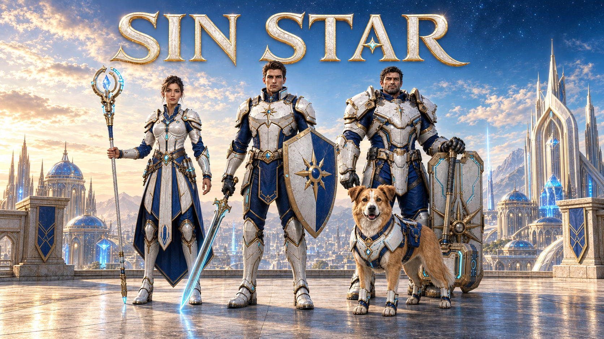
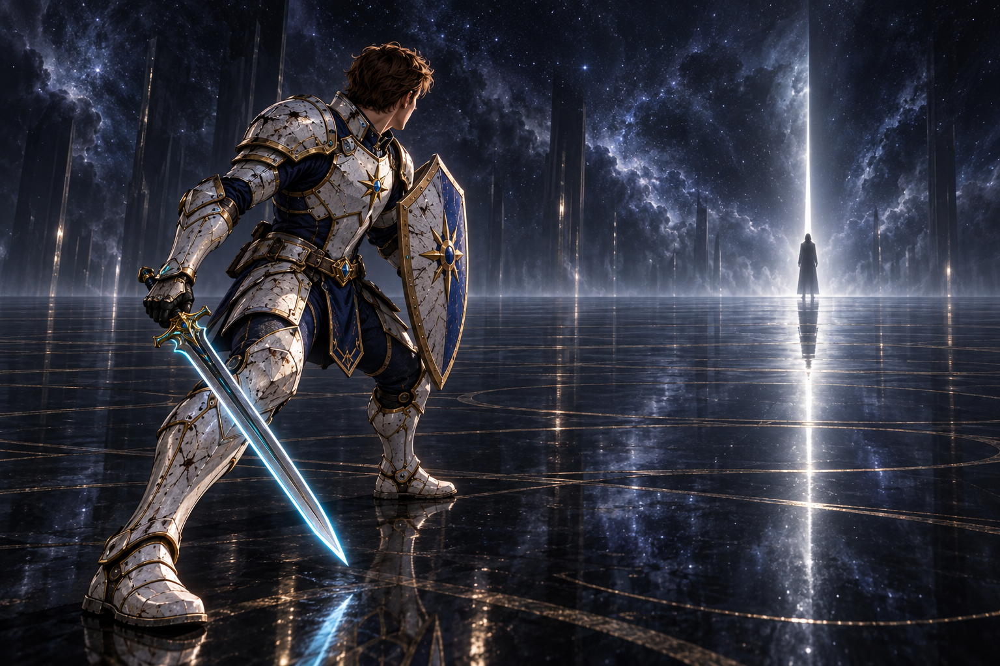
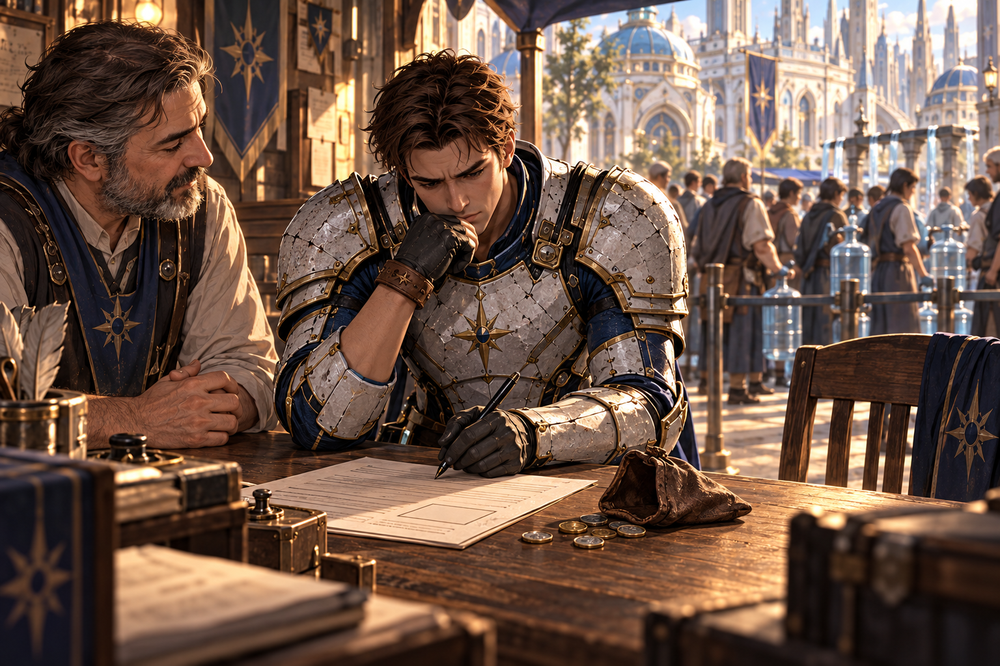
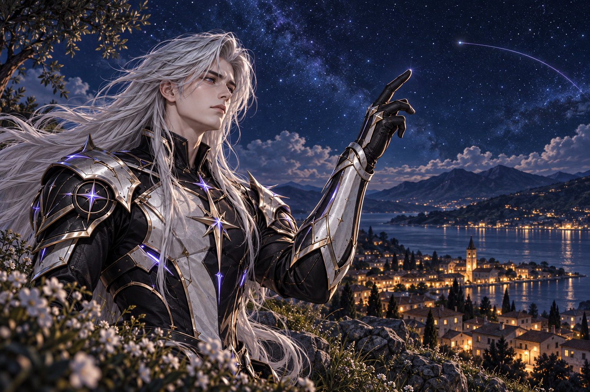
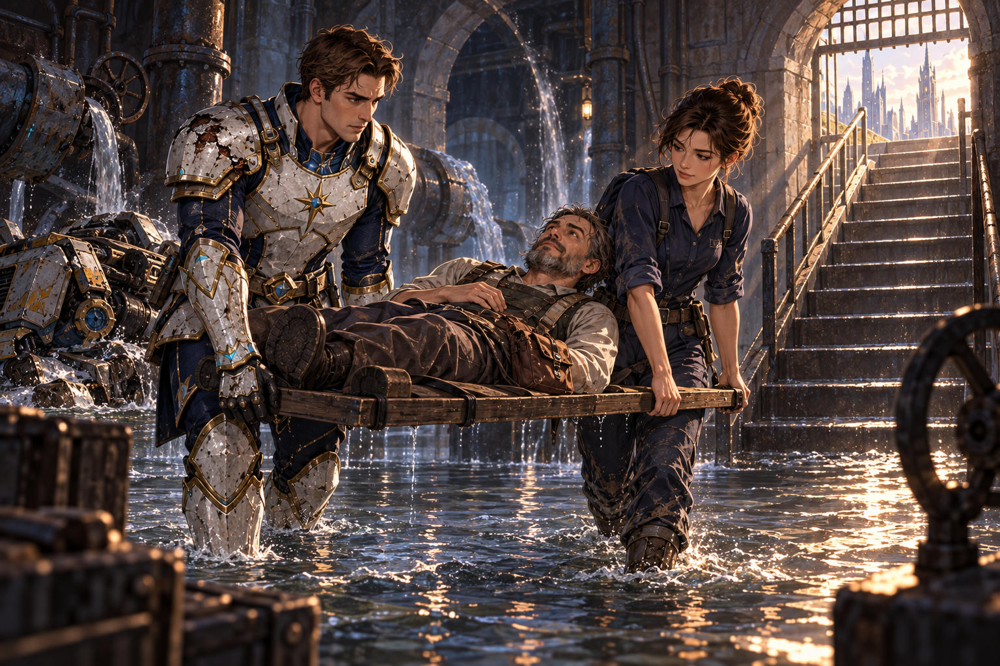
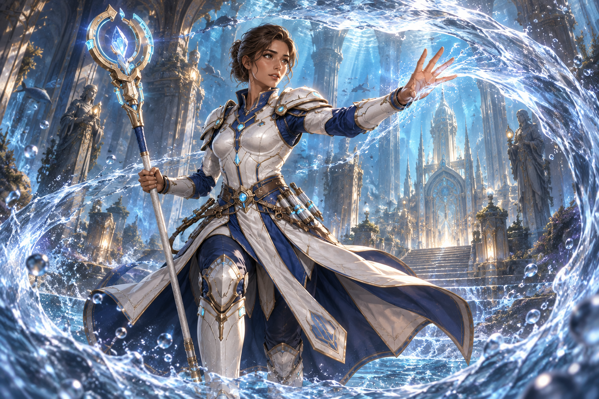
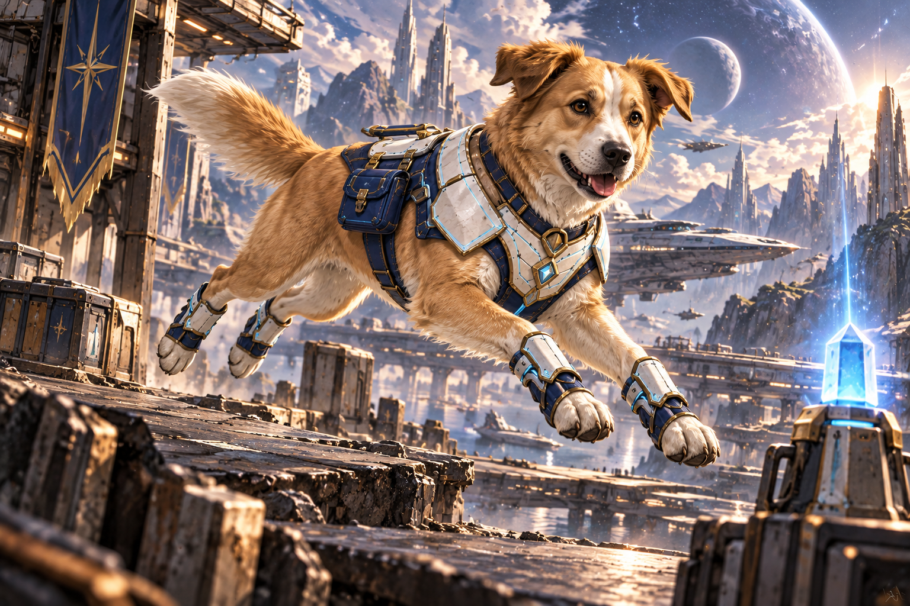
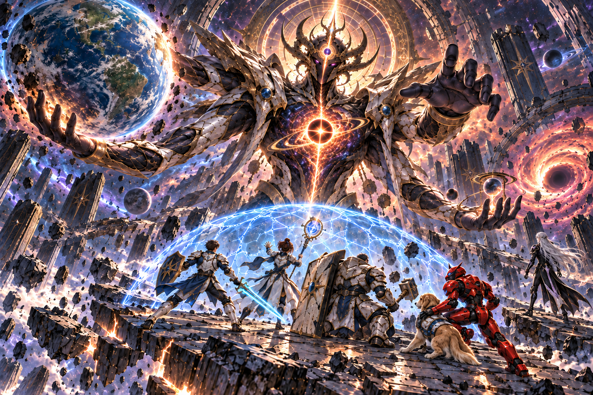

[**▶ Watch the Sin Star trailer on YouTube**](https://youtu.be/IuDbnSnKEPo)

# Sin Star: Story, Storyboard & Clips

**By Louiery R. Sincioco (Sin)**

Arin's search for a place to belong opens into a journey across worlds, shaped by
friendship and the mysterious power of the Axiom. As his companions become a
chosen family, the stakes grow beyond survival: what should extraordinary power
protect, and who gets to decide how others live?

Kael's struggle with grief, control, and the possibility of redemption forms the
other side of that conflict. This science-fantasy story explores responsibility,
belonging, and the hope of caring for a universe that cannot be made perfect.

This repository presents the illustrated storyboard, complete game script,
cinematic films, and individual concept clips for *Sin Star I*, a game in
development using the [SMILE 2.0 tools](https://github.com/Sincioco/smile-2.0).

## Explore the project

**[Explore the live story and storyboard website](https://sincioco.github.io/SinStar_Storyboard/)**

- [Illustrated storyboard](https://sincioco.github.io/SinStar_Storyboard/)
- [Complete script](https://sincioco.github.io/SinStar_Storyboard/Sin-Star-I-Game-Script-v0.2.html)
- [Films and trailer](https://sincioco.github.io/SinStar_Storyboard/movies.html)
- [Video clips](https://sincioco.github.io/SinStar_Storyboard/review.html)

The web edition uses verified YouTube videos. Unpublished takes are marked and
retain their illustrations; no local video binaries are stored in this repository.

## A glimpse of the journey

**An impossible dream.** Arin faces a mystery larger than the life he knows.

**An ordinary decision.** A contract in Neris becomes another step into the unknown.

**A signal across the stars.** Personal choices become part of a much larger story.

**Companions in action.** Trust begins with people showing up when they are needed.

**Mira.** A companion whose care matters as much as her power.

**Milo.** Another reason this journey is about the people—and companions—beside you.

## Updating this site

GitHub Pages publishes `docs/` from `main`. The authoritative authoring site and
original media remain in the separate
[SinStarI project](https://github.com/Sincioco/SinStarI).

Use the local `Sincioco.com/tools/Update-Storyboard.ps1` workflow to dry-run,
update, validate, or restore the public copy, then review and publish separately.
Its companion `README-Storyboard.md` explains the explicit file list and recovery
copies. Verified YouTube uploads must be recorded in the authoring project's
registry before running the updater. Keep private production tools, credentials,
and video masters out of this repository.

## Final-boss battle

*Spoiler image: a glimpse of the confrontation with Aevos, from the final-battle storyboard.*

